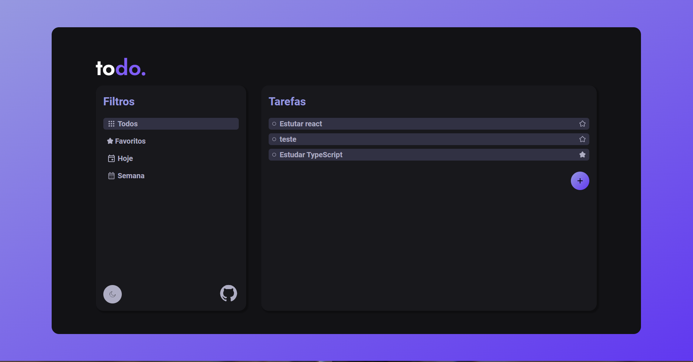
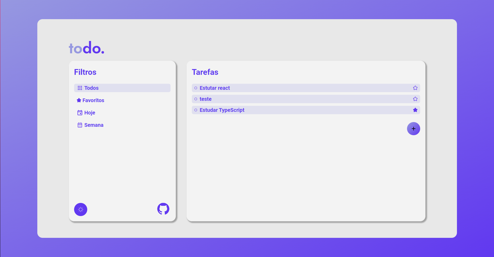
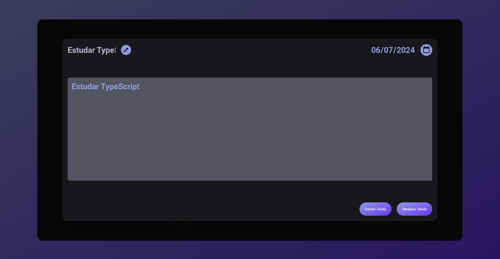
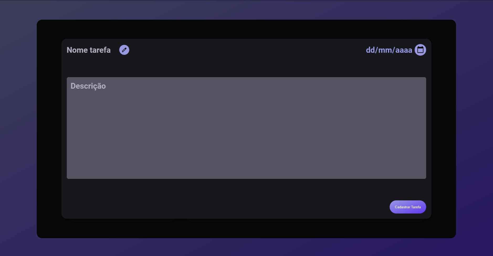
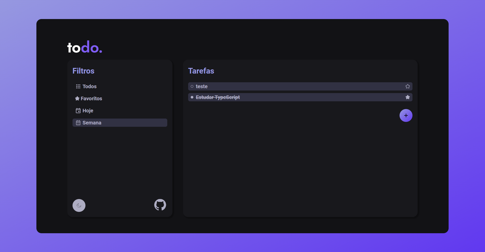
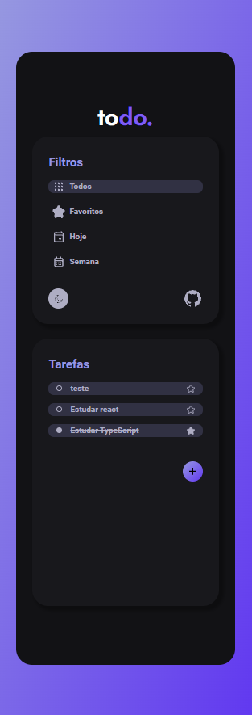
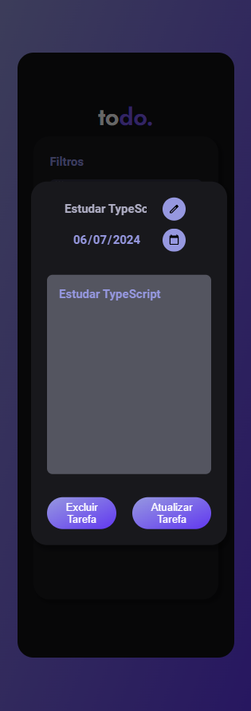

<!DOCTYPE html>
<html lang="pt-BR">
<head>
    <meta charset="UTF-8">
    <meta name="viewport" content="width=device-width, initial-scale=1.0">
    <link rel="stylesheet" href="styles/main.css">
</head>
<body>

<h1>To-Do List</h1>

Este projeto de é uma aplicação web interativa que permite aos usuários gerenciar suas tarefas diárias de forma eficiente. Utilizando SASS para estilização, JavaScript Puro com Programação Orientada a Objetos para lógica e JSON Server para simular uma API com um CRUD completo, a aplicação oferece funcionalidades como cadastro, exclusão, visualização e atualização de tarefas, além de permitir a alternância entre temas Light e Dark, favoritar e completar tarefas e filtrar por diferentes critérios (favoritas, do dia, da semana e todas).

<h2>📋 Funcionalidades Principais</h2>
<ol>
    <li><strong>Tarefas:</strong>
        <ul>
            <li>Cadastrar, excluir, visualizar e atualizar tarefas.</li>
        </ul>
    </li>
    <li><strong>Marcação de Conclusão:</strong>
        <ul>
            <li>Favoritar e completar tarefas.</li>
        </ul>
    </li>
     
    <li><strong>Temas:</strong>
        <ul>
            <li>Alternar entre temas Light e Dark.</li>
        </ul>
    </li>
     
</ol>

<h2>🔧 Tecnologias Utilizadas</h2>

<h3>Front-end:</h3>
<ul>
    <li><strong>Linguagem:</strong> JavaScript ES6 com Programação Orientada a Objetos (POO)</li>
    <li><strong>Estilização:</strong> SASS (utilizando o padrão 7-1)</li>
</ul>

<h3>Back-end (API Fake):</h3>
<ul>
    <li><strong>CRUD:</strong> JSON Server</li>
</ul>

<h2>👥 Desenvolvedor</h2>
<ul>
    <li><a href="https://www.linkedin.com/in/filipe-góis-841b58206/" target="_blank"><strong>Filipe Góis</strong></a> - Desenvolvedor Full Stack</li>
</ul>

<h2>📸 Exemplos Visuais da Aplicação</h2>

    <figure style="display: flex; flex-direction: column; align-items: center;">
        
    </figure>
    <figure style="display: flex; flex-direction: column; align-items: center;">
        
    </figure>
     <figure style="display: flex; flex-direction: column; align-items: center;">
        
    </figure>
    <figure style="display: flex; flex-direction: column; align-items: center;">
        
    </figure>
    <figure style="display: flex; flex-direction: column; align-items: center;">
        
    </figure>
        <figure style="display: flex; flex-direction: column; align-items: center;">
        
    </figure>
    <figure style="display: flex; flex-direction: column; align-items: center;">
        
    </figure>
    <figure style="display: flex; flex-direction: column; align-items: center;">
        
    </figure>

</body>
</html>
